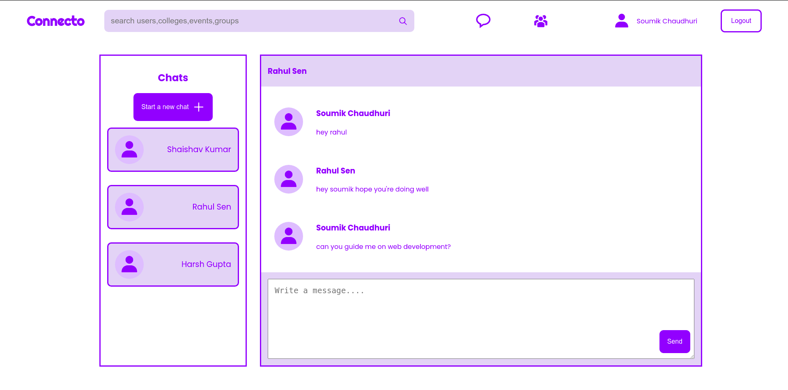

# Connecto - A Social media website for college students

Connecto is a social media website for college students which acts as a medium for people from different colleges all over the country to interact, communicate and meet like minded people.

## Features

1. Create posts and events.
2. Add people to connections and chat with them.
3. Search for users and view their profile.

## Future Updates 

1. Making it responsive.
2. Adding groups functionality ( now groups are hard coded ).

## Built with

1. <a href='https://nextjs.org/'>next.js v10 with react v17</a>: Routing and server side rendering with Next.js.
2. <a href='https://reactjs.org/docs/context.html'>Context API</a>: Used in state management for users, and for firebase.
3. <a href='https://www.npmjs.com/package/react-spinners'>react-spinners</a>: For loading animations
4. <a href='https://www.npmjs.com/package/js-cookie'>js-cookie</a>: To store the authorization token in cookies.
5. <a href='https://firebase.google.com/'>Firebase</a>: Firebase used for authentication and Cloud Firestore for storing data of the application.

## Screenshots

## To Run

1. Clone into repo
2. Run `npm install`
3. Create a folder called config and create a file firebaseConfig.js for your firebase app credentials.
4. Run `npm run dev`

## Live Demo

https://connecto.vercel.app/
